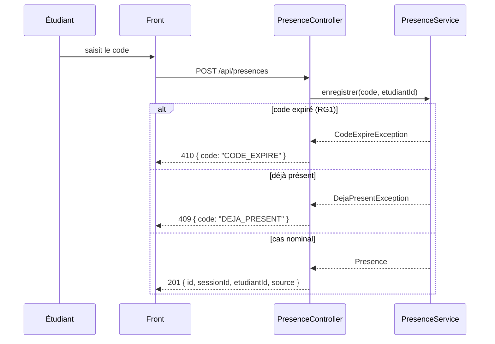

# ÉPREUVE FINALE FULLSTACK — KFOKAM48

## Sujet remis au candidat

**Tu travailles à ton rythme. Ta soumission doit être déposée sur la plateforme avant 18h00.**
**Backend imposé : Java / Spring Boot** · **Frontend au choix : React, Angular ou Next.js**
**Documentation libre · IA libre, sans aucune restriction · Aucun examinateur**

---

## AVANT DE COMMENCER — LIS CECI EN ENTIER

Il n'y a **pas d'horaires imposés**. Pas de phase chronométrée, pas de jalon à telle heure. Tu avances à ta vitesse, dans l'ordre des cinq étapes ci-dessous. Une seule échéance : **18h00, dépôt de ta soumission sur la plateforme.** Après, la plateforme n'accepte plus rien.

Il n'y a **personne pour répondre à tes questions**. Les surveillants gèrent la salle et le matériel, rien d'autre.

**Ce qui est évalué n'est pas la beauté de ton application.** C'est la manière dont tu mènes un développement du début à la fin, et la façon dont tu utilises Git. **Ton dépôt est ta copie d'examen** : le correcteur lira ton historique comme on lit une rédaction.

Corollaire : l'IA peut probablement écrire cette application en deux heures. Ce n'est pas le sujet.

### Ton dossier `EPREUVE/`

| Élément | Contenu |
|---|---|
| `SUJET.md` | Ce document |
| `CLIENT.md` | Le client « en boîte » : 16 questions déjà posées et ses réponses — Annexe A |
| `api/contrat.yaml` | Le contrat d'API imposé : 5 opérations — Annexe B |
| *(l'enveloppe)* | Remise par le surveillant, sur demande, une fois ton jalon `v0.1` poussé |
| `modeles/` | Squelettes de `CAHIER_DES_CHARGES.md`, `JOURNAL.md`, `SOUMISSION.md` |

### Ton dépôt

**Tu travailles sur ton propre compte GitHub, dans un dépôt public que tu crées toi-même.**

- Nom imposé : **`kfokam48-epreuve-<ton-matricule>`** — exemple : `kfokam48-epreuve-KF48-YAO-042`
- **Visibilité publique obligatoire.** Un dépôt privé ou un lien inaccessible au moment de la correction = copie non corrigée.
- Les **issues** et les **pull requests** de ce dépôt font partie du barème : tu les utilises sur ton propre dépôt, tu n'as besoin de personne.
- Si tu n'as pas encore de compte GitHub, crée-le maintenant, c'est la première chose à faire.

Structure imposée, un seul dépôt :

```
/docs         CAHIER_DES_CHARGES.md · JOURNAL.md · diagrammes/
/api          contrat.yaml
/backend      Spring Boot (Java 17+, Maven, wrapper mvnw commité)
/frontend     React, Angular ou Next.js
```

Pousse régulièrement. Un travail excellent resté en local vaut zéro.

---

## 1. LE BESOIN

Le client est la direction de la formation KFOKAM48. Sa demande, telle qu'il l'a écrite :

> 1. Un formateur ouvre une session de cours et obtient un **code de présence**.
> 2. Un étudiant saisit ce code pour **marquer sa présence**.
> 3. Un étudiant **dépose le lien** de son exercice pour une session.
> 4. Un étudiant est assigné à la **relecture** de l'exercice d'un pair : note et commentaire.
> 5. Le formateur voit un **tableau** : présence et moyenne des notes par étudiant.

Cette demande est incomplète et, par endroits, **elle se contredit**. C'est normal, c'est ce que tu recevras toute ta vie professionnelle. `CLIENT.md` contient 16 questions déjà posées au client. Toutes ne sont pas utiles. **Deux réponses se contredisent**, et il reste **un trou que personne n'a vu**. À toi de repérer, de trancher, et d'**écrire** ce que tu décides à la place du client.

> **Le rendu visuel n'est pas noté. Aucun point pour le CSS.**

---

## 2. LES CINQ ÉTAPES

Dans cet ordre. L'ordre se lit dans ton historique Git, et il est noté.

> **Les trois jalons.** Aux étapes 1, 2 et 4, tu marques ton avancement par un **commit dédié**, vide de code, dont le message est exactement `[JALON] analyse`, `[JALON] v0.1` puis `[JALON] v1.0`. Rien d'autre à apprendre, c'est un commit ordinaire :
>
> ```bash
> git commit --allow-empty -m "[JALON] v0.1"
> git push
> ```
>
> Ces trois commits servent de repères au correcteur et au script `enveloppe`. Un jalon non poussé n'existe pas.

### Étape 1 — Analyser, spécifier, concevoir

**Aucun code. Pas de `spring init`.** C'est l'étape la plus lourde du barème : 38 points sur 100 se jouent ici. Tu produis quatre choses.

#### a) `docs/CAHIER_DES_CHARGES.md`

Un vrai cahier des charges, avec ces dix sections, dans cet ordre :

1. **Contexte et objectif** — à quel problème l'application répond
2. **Acteurs et rôles** — qui fait quoi
3. **Périmètre** — ce qui est dans le projet, et explicitement ce qui n'y est pas
4. **Exigences fonctionnelles**, numérotées `EF1`, `EF2`… chacune avec son **critère d'acceptation vérifiable**
5. **Exigences non fonctionnelles** — volumétrie, usage mobile, temps de réponse, ce que tu juges nécessaire
6. **Règles de gestion**, numérotées `RG1`, `RG2`… — expiration du code, unicité d'une présence, interdiction de se relire soi-même, note entière de 0 à 20, etc.
7. **Zones d'ombre, hypothèses et contradictions tranchées**, en renvoyant aux questions `Qx` de `CLIENT.md`
8. **Contraintes techniques** imposées par le sujet
9. **Livrables**
10. **Démarche prévue** — comment tu comptes mener les cinq étapes

> Les règles de gestion sont numérotées pour une raison : tu t'y réfères dans tes issues, dans tes messages de commit et dans tes tests. Une règle qu'on ne peut pas citer est une règle qu'on oublie.

#### b) Trois diagrammes, dans `docs/diagrammes/`

| | Diagramme | Ce qu'il doit montrer |
|---|---|---|
| **D1** | **Cas d'utilisation** | Les acteurs et ce que chacun peut faire |
| **D2** | **Classes ou modèle de données** | Les entités, leurs attributs et leurs cardinalités. **Il doit correspondre à tes migrations** |
| **D3** | **Séquence — « marquer sa présence »** | Le cas nominal **et au moins deux cas d'erreur** : code expiré et étudiant déjà présent. **Il doit correspondre aux codes HTTP du contrat** |

**Format imposé : Mermaid ou PlantUML, en texte, versionnés dans le dépôt.** Pas de capture d'écran, pas de PNG exporté d'un outil en ligne. Un diagramme qu'on ne peut pas diffuser en diff est un diagramme qu'on ne maintient jamais — et GitHub affiche le Mermaid directement dans tes fichiers Markdown.

> **Bonus +3 points** : un quatrième diagramme, **états-transitions du cycle de vie d'un exercice** (déposé → en attente de relecture → relu). Facultatif, la note reste plafonnée à 100.

#### c) Ton backlog, en issues sur ton dépôt

**Oui, tu dois créer des issues.** Une *issue* — ce qu'on appelle aussi un *ticket* — est une fiche de travail que tu ouvres toi-même dans l'onglet **Issues** de ton dépôt GitHub. Une issue = une chose à faire. Elles constituent ton plan de travail, et c'est à elles que tu rattacheras tes branches et tes commits.

Compte une dizaine d'issues pour ce projet. Chacune porte :

- un **titre qui décrit un résultat**, pas une tâche technique — « L'étudiant marque sa présence avec un code », pas « créer l'entité Presence » ;
- des **critères d'acceptation vérifiables**, formulés « quand … alors … » ;
- une **priorité** : Must, Should ou Could ;
- le **renvoi** à l'exigence `EFx` ou à la règle `RGx` de ton cahier des charges.

*Exemple d'issue :*

> **Titre :** L'étudiant marque sa présence avec un code
>
> Réf. `EF1` · Règles `RG1` (expiration 15 min), `RG5` (une seule présence par session) · Priorité **Must** · Estimation 2 h
>
> **Critères d'acceptation**
> - Quand je saisis un code valide et non expiré, ma présence apparaît dans le tableau du formateur
> - Quand le code a plus de 15 minutes, je reçois une erreur `410 CODE_EXPIRE`
> - Quand j'ai déjà marqué ma présence, je reçois une erreur `409 DEJA_PRESENT`

Ensuite, pendant la construction : **une branche par issue**, et un commit qui la ferme en la citant.

```bash
git checkout -b feature/presence-code
git commit -m "Enregistrement d'une présence par code (RG1) — Closes #4"
```

Écrire `Closes #4` dans le message ferme automatiquement l'issue n° 4 quand la branche est fusionnée. C'est ce lien entre ton plan et ton code que le correcteur regarde.

#### d) `api/contrat.yaml` complété

Les 5 opérations imposées **plus** celles dont tu as besoin.

---

Puis tu poses ton **jalon d'analyse** : un commit dont le message est exactement

```
[JALON] analyse
```

> Ce commit doit précéder ton premier commit de code. C'est l'ordre dans l'historique qui fait foi, pas l'heure.

### Étape 2 — Construire la première version

Les stories **Must** uniquement. Une branche par ticket, une PR par branche, les issues fermées par les commits.

Puis tu poses ton deuxième jalon et tu pousses :

```
[JALON] v0.1
```

### Étape 3 — Ouvrir l'enveloppe

Dès que ton commit **`[JALON] v0.1`** est poussé, **demande l'enveloppe au surveillant** en lui donnant l'adresse de ton dépôt. Elle te sera remise aussitôt. Elle contient la suite du sujet : **un bug signalé par le client et un changement de besoin**.

Tu ne peux pas l'obtenir avant d'avoir poussé ce jalon.

> **Information que tu reçois dès maintenant pour pouvoir en tenir compte :** l'enveloppe touchera à la fois ta base de données, ton contrat d'API et ton frontend. Si ton schéma n'est pas versionné quand tu l'ouvres, tu le paieras cher.
>
> Et elle rendra **une partie de ton analyse fausse**. Un cahier des charges et des diagrammes qui décrivent encore l'ancien besoin après l'étape 3 sont des documents morts. Mets-les à jour dans un commit qui le dit — c'est noté.

### Étape 4 — Livrer la version finale

Troisième jalon, un commit **`[JALON] v1.0`**, puis `CHANGELOG.md` cohérent avec ton historique, `README` d'installation **testé depuis un clone vierge**, backlog restant trié.

### Étape 5 — Soumettre

**C'est cette étape qui valide ton examen. Sans elle, tu n'as rien rendu.**

Tu rédiges un fichier `SOUMISSION.md` et tu le **téléverses sur la plateforme** avant 18h00 :

```markdown
# Soumission — Épreuve finale fullstack KFOKAM48

Nom et prénom(s) : ...
Matricule        : KF48-...-...
Centre           : Yaoundé | Douala | Bafoussam

## Projet
Dépôt GitHub (public) : https://github.com/<compte>/kfokam48-epreuve-<matricule>
Commit final (hash complet sur 40 caractères) : ...

## Divers
Frontend choisi       : React | Angular | Next.js
Commande de démarrage : ...
```

Trois points à comprendre :

1. **La correction porte exactement sur le commit que tu déclares.** Tout ce que tu pousses après est ignoré. Termine, pousse, puis copie son hash complet.
2. **Ton dépôt doit rester public et accessible** jusqu'à la publication des résultats. Ne le supprime pas, ne le passe pas en privé.
3. **Un lien mort, un hash invalide ou un dépôt privé rendent ta copie non corrigeable.** Vérifie ton lien depuis une fenêtre de navigation privée avant de soumettre.

---

## 3. LES CONTRAINTES TECHNIQUES

Non négociables. Un projet qui ne les respecte pas perd les points correspondants, même s'il fonctionne.

### Backend — Spring Boot

| # | Contrainte |
|---|---|
| **B1** | Java 17 ou plus, Maven, **wrapper `mvnw` commité** |
| **B2** | **Le contrat `api/contrat.yaml` est respecté à la lettre** : chemins, verbes, codes de statut, format d'erreur |
| **B3** | **Séparation des couches** contrôleur / service / repository. Aucune requête base dans un contrôleur, aucune entité JPA exposée en JSON — tu passes par des DTO |
| **B4** | **Validation des entrées** et **gestion centralisée des erreurs** (`@RestControllerAdvice`). Une stack trace renvoyée au client est une faute |
| **B5** | **Schéma versionné** par Flyway ou Liquibase, migrations commitées. `ddl-auto=update` interdit hors tests |
| **B6** | **Deux tests qui prouvent quelque chose** : un test unitaire sur une règle métier réelle, un test d'intégration sur un endpoint. Ils tournent sur un poste vierge, sans ta base locale |

### Frontend — React, Angular ou Next.js

| # | Contrainte |
|---|---|
| **F1** | Framework **déclaré et justifié en une ligne** dans le `README`, et **le build passe** |
| **F2** | **Trois écrans** : formateur (ouvrir une session, voir le tableau), étudiant (marquer sa présence, déposer son exercice), relecteur (faire une relecture) |
| **F3** | Appels API dans **une couche dédiée**, pas de `fetch` dispersé · **états de chargement et d'erreur gérés** · **aucune règle métier dupliquée** : la moyenne affichée vient de l'API, tu ne la recalcules pas |

### Démarrage

`docker compose up`, ou **trois commandes maximum** documentées dans le `README` et testées depuis un clone vierge. Prévois **quelques données de démonstration** chargées au démarrage, sinon le correcteur ouvre une application vide et ne peut rien vérifier.

---

## 4. CE QUI EST NOTÉ — BARÈME SUR 100

Tu le connais dès le départ, il n'y a rien de caché.

### Analyse et conception — 38 points

| | Pts |
|---|---:|
| `CAHIER_DES_CHARGES.md` : les dix sections, exigences et règles de gestion numérotées avec critères vérifiables, contradictions tranchées et justifiées | 10 |
| **Les trois diagrammes** : justesse du formalisme, et surtout **cohérence** — D2 avec tes migrations, D3 avec les codes HTTP du contrat | 12 |
| Backlog : issues avec critères d'acceptation, priorisation assumée, renvoi aux `EFx` / `RGx` | 8 |
| Contrat d'API complété **et figé avant le premier commit de code** | 5 |
| Analyse maintenue à jour après l'étape 3 : cahier des charges et diagrammes corrigés | 3 |
| *Bonus : quatrième diagramme états-transitions* | *+3* |

### Conduite du changement — 10 points

L'étape 3 : issue ouverte avant de coder, bug reproduit, migration versionnée, contrat mis à jour, re-priorisation écrite, correctif et évolution séparés.

### Git — 30 points

Tout se joue sur l'historique de ton dépôt de projet.

| | Pts |
|---|---:|
| **Commits atomiques et messages explicites** — un commit = une idée ; `update`, `fix`, `test2` valent zéro | 8 |
| **Une branche par issue, une PR par branche**, chaque PR rattachée à son issue | 7 |
| **Les trois commits `[JALON]`** présents, poussés et dans l'ordre | 5 |
| **`.gitignore` Java + JS posé avant le premier commit de code**, aucun fichier généré dans l'historique | 5 |
| **`main` toujours sain**, aucun secret nulle part dans l'historique | 5 |

### Produit et conformité — 17 points

| | Pts |
|---|---:|
| Conformité au contrat d'API, codes HTTP justes **y compris les erreurs** | 7 |
| Conformité B3 à B6 et F1 à F3 | 7 |
| Démarre chez un tiers depuis ton seul `README`, avec des données de démonstration | 3 |

### Journal — 5 points

`JOURNAL.md`, **une entrée par étape**, trois lignes suffisent : ce que tu viens de faire, ce qui t'a bloqué et combien de temps, **ce que tu as demandé à l'IA et comment tu as vérifié sa réponse**. Un journal écrit d'un bloc à la fin se repère dans l'historique Git et ne compte pas.

### Malus

| | |
|---|---:|
| Un secret dans l'historique, ou `target/` · `node_modules/` · `dist/` commités | −5 |
| Aucune issue de toute la journée | −10 |
| Un seul commit, ou tout l'historique concentré sur la dernière heure | −10 |
| Jalon `[JALON] analyse` manquant, ou placé après le premier commit de code | −5 |
| `push --force` destructeur sur `main` | −5 |
| Dépôt privé, lien mort ou hash invalide au moment de la correction | copie non corrigée |

---

## 5. RÈGLES

- **IA totalement libre.** Tous les outils, aucune trace exigée. Le journal te demande seulement **comment tu as vérifié** ce qu'elle t'a rendu.
- **Internet est nécessaire** : ton dépôt est sur GitHub et ta soumission passe par la plateforme. Pousse au fur et à mesure plutôt que tout à la fin.
- **Silence** pendant toute l'épreuve.
- **Aucune question ne sera prise sur le sujet.** S'il te manque une information, décide à la place du client et écris-le dans la section 7 de ton cahier des charges. C'est l'épreuve.
- **Panne matérielle ou coupure réseau** : préviens le surveillant, il note l'heure, le temps t'est rendu.
- **18h00 : fermeture de la plateforme.** Ne soumets pas à 17h58.

---

## 6. CONSEIL

Tu vas être tenté de lancer `spring init` dans les dix premières minutes. Ne le fais pas.

**38 points se jouent à l'étape 1, avant la première ligne de code.** Les 30 points de Git se gagnent par une discipline tenue du début à la fin, jamais par un rattrapage final. Et la plupart de ceux qui souffriront à l'étape 3 souffriront pour une seule raison : un schéma de base non versionné.

L'application entière, elle, ne pèse que 17 points. Un candidat qui se met à coder sans avoir rien écrit et sans avoir ouvert une seule issue plafonne autour de 40 sur 100, même si son application est parfaite. Celui qui livre les trois quarts du produit avec une analyse solide et un historique lisible dépasse 80.

---

# ANNEXE A — `CLIENT.md`

*Le client n'est pas disponible. Voici les 16 questions qui lui ont déjà été posées et ses réponses, telles qu'il les a formulées.*

**Q1 — Faut-il un mot de passe ?**
Non, l'étudiant choisit son nom dans une liste. Ne perdez pas de temps là-dessus.

**Q2 — Le code de présence expire-t-il ?**
Oui, 15 minutes après l'ouverture de la session. Après, il ne marche plus.

**Q3 — Peut-on marquer sa présence après la fin de la session ?**
Non.

**Q4 — Et s'il se trompe de code plusieurs fois ?**
Qu'il réessaie. Au bout de cinq erreurs, bloquez-le deux minutes, sinon ils vont deviner les codes entre eux.

**Q5 — Un étudiant peut-il relire son propre exercice ?**
Jamais. C'est le principe même.

**Q6 — Combien de relecteurs par exercice ?**
Un seul.

**Q7 — Qui choisit le relecteur ?**
Le système, au hasard, parmi les étudiants **présents à cette session**.

**Q8 — L'étudiant relu voit-il sa note ?**
Oui, la note et le commentaire. Mais pas le nom du relecteur.

**Q9 — Sur combien est la note ?**
Sur 20, en nombres entiers.

**Q10 — Un relecteur peut-il corriger sa note après l'avoir envoyée ?**
Oui, tant que le formateur n'a pas clôturé la session.

**Q11 — Et si le relecteur ne rend jamais sa relecture ?**
L'exercice reste « en attente » et je dois le voir clairement dans mon tableau.

**Q12 — Peut-on déposer son exercice après la fin de la session ?**
Oui, jusqu'à ce que je clôture la session. Certains n'ont pas de connexion le soir même.

**Q13 — Peut-on remplacer le lien de son exercice ?**
Oui, tant que personne n'a commencé à le relire.

**Q14 — Puis-je ajouter une présence à la main ?**
Oui, ça arrive qu'un étudiant ait un souci de téléphone. Mais il faut que ça se voie : marquez « ajouté par le formateur ».

**Q15 — La note est-elle définitive une fois envoyée ?**
Oui. Une fois que le relecteur a validé, c'est fini, il ne peut plus y revenir. C'est plus honnête pour tout le monde.

**Q16 — Que dois-je voir dans mon tableau ?**
Par étudiant : sa présence à chaque session, combien d'exercices il a déposés, la moyenne des notes reçues, et les relectures qu'il doit encore faire.

---

# ANNEXE B — CONTRAT D'API IMPOSÉ

*Extrait lisible de `api/contrat.yaml`. Ces cinq opérations doivent exister exactement ainsi. Tout le reste de ton API est libre.*

| Opération | Succès | Erreurs attendues |
|---|---|---|
| `POST /api/sessions`<br>`{ titre, promotionId }` | `201` `{ id, code, ouvertureAt, expirationAt }` | `400` champ manquant |
| `POST /api/presences`<br>`{ code, etudiantId }` | `201` `{ id, sessionId, etudiantId, source }` | `400` code inconnu · `409` déjà présent · `410` code expiré |
| `POST /api/exercices`<br>`{ sessionId, etudiantId, lien }` | `201` `{ id, statut }` | `400` lien invalide · `409` exercice déjà déposé |
| `POST /api/relectures/{id}`<br>`{ note, commentaire }` | `200` | `400` note hors 0–20 ou non entière · `403` relecture de son propre exercice · `409` relecture déjà rendue |
| `GET /api/tableau?promotionId=` | `200` `[ { etudiantId, nom, presences, exercicesDeposes, moyenne, relecturesEnAttente } ]` | `404` promotion inconnue |

**Format d'erreur imposé, pour toutes les erreurs sans exception :**

```json
{ "code": "CODE_EXPIRE", "message": "Le code de présence a expiré." }
```

Une stack trace, un corps vide ou la page d'erreur par défaut de Spring valent zéro sur ce critère.

> Le champ `source` d'une présence vaut `ETUDIANT` ou `FORMATEUR`. Si tu te demandes pourquoi, relis Q14.

---

# ANNEXE C — MODÈLES

**`docs/CAHIER_DES_CHARGES.md`**

```markdown
# Cahier des charges — <nom du projet>
Auteur : <matricule>  ·  Version 1  ·  Frontend choisi : <React|Angular|Next.js>, parce que ...

## 1. Contexte et objectif
## 2. Acteurs et rôles
| Acteur | Ce qu'il peut faire |

## 3. Périmètre
Inclus : ...
Exclu  : ...

## 4. Exigences fonctionnelles
| Réf | Exigence | Critère d'acceptation | Priorité |
| EF1 | L'étudiant marque sa présence avec un code | Quand je saisis un code valide, ma présence apparaît dans le tableau du formateur | Must |

## 5. Exigences non fonctionnelles
| Réf | Exigence | Comment on la vérifie |

## 6. Règles de gestion
| Réf | Règle | Source |
| RG1 | Le code de présence expire 15 minutes après l'ouverture de la session | Q2 |
| RG2 | Un étudiant ne peut pas relire son propre exercice | Q5 |

## 7. Zones d'ombre, hypothèses et contradictions
| Point | Réponse client (Qx) ou hypothèse | Décision retenue | Pourquoi |

## 8. Contraintes techniques
## 9. Livrables
## 10. Démarche prévue
Definition of Done : une issue est terminée quand ...
```

**`docs/diagrammes/` — exemple de format attendu**

````markdown
# D3 — Séquence : marquer sa présence


````

**`JOURNAL.md`**

```markdown
## Étape 1 — Analyse et conception
Fait : cahier des charges (9 EF, 12 RG), les 3 diagrammes en Mermaid, 11 issues
créées, contrat complété, commit `[JALON] analyse` poussé.
Bloqué : 12 min sur la contradiction Q10 / Q15, tranchée en faveur de Q10 — Q11
décrit un usage réel, Q15 est une intention.
IA : m'a proposé 18 issues, j'en ai retenu 11. Les autres étaient des tâches
techniques, pas des résultats utilisateur. Vérifié en relisant chaque titre :
est-ce que le client le comprendrait ?
```

---

*Épreuve finale KFOKAM48 — sujet candidat. Aucune assistance humaine. Soumission sur la plateforme avant 18h00.*
