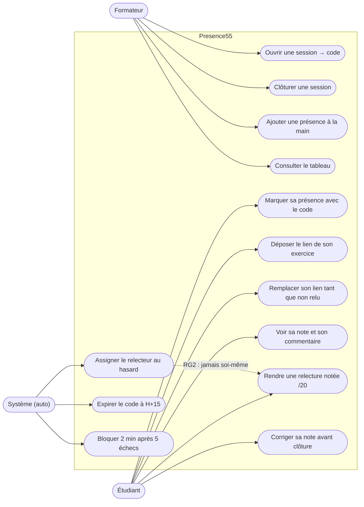

# D1 — Cas d'utilisation

```mermaid
graph LR
    formateur([Formateur])
    etudiant([Étudiant])
    systeme(["Système (auto)"])

    subgraph Presence55
      UC1([Ouvrir une session → code])
      UC2([Clôturer une session])
      UC3([Ajouter une présence à la main])
      UC4([Consulter le tableau])
      UC5([Marquer sa présence avec le code])
      UC6([Déposer le lien de son exercice])
      UC7([Remplacer son lien tant que non relu])
      UC8([Voir sa note et son commentaire])
      UC9([Rendre une relecture notée /20])
      UC10([Corriger sa note avant clôture])
      UC11([Assigner le relecteur au hasard])
      UC12([Expirer le code à H+15])
      UC13([Bloquer 2 min après 5 échecs])
    end

    formateur --> UC1
    formateur --> UC2
    formateur --> UC3
    formateur --> UC4
    etudiant --> UC5
    etudiant --> UC6
    etudiant --> UC7
    etudiant --> UC8
    etudiant --> UC9
    etudiant --> UC10
    systeme --> UC11
    systeme --> UC12
    systeme --> UC13
    UC11 -. RG2 : jamais soi-même .-> UC9
```
