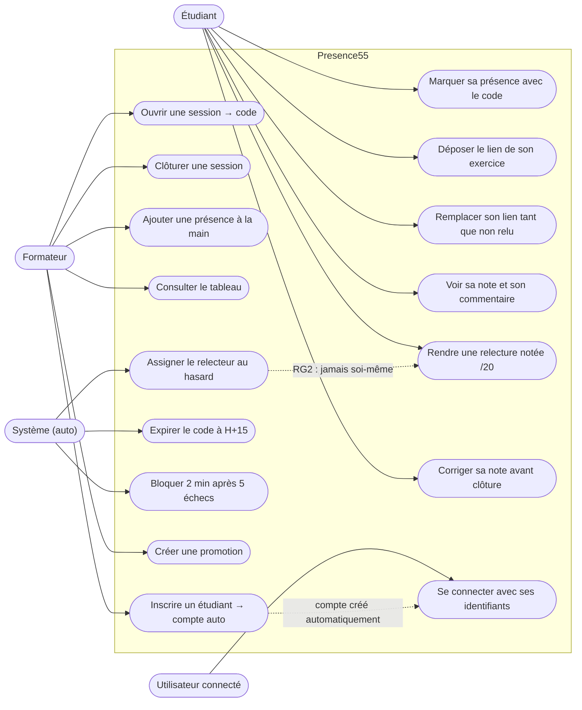

# D1 — Cas d'utilisation

**Évolutions post-soumission (CDC 7.14/7.15)** : UC14 connexion par comptes (BCrypt + JWT, rôle
FORMATEUR ou ETUDIANT, identité portée par le token) ; UC15/UC16 gestion des promotions et des
étudiants, réservées au formateur. En mode `AUTH_REQUIS=false` (contrat initial, Q1), UC14
disparaît : l'étudiant choisit librement son nom dans la liste.
