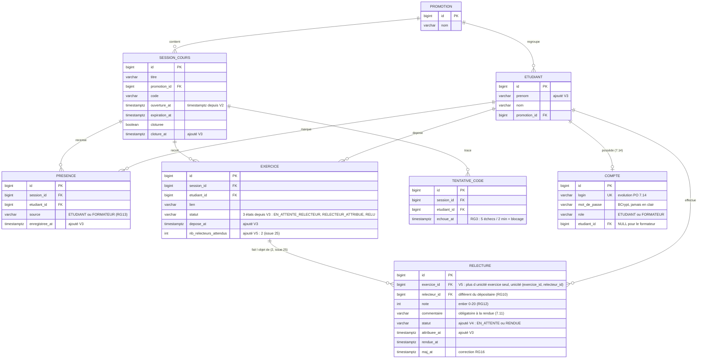

# D2 — Modèle de données (V1__init.sql + évolutions V2→V6)

Contraintes uniques portées par les migrations : `PRESENCE (session_id, etudiant_id)` (RG13) ·
`EXERCICE (session_id, etudiant_id)` (409 EXERCICE_DEJA_DEPOSE) · `RELECTURE (exercice_id, relecteur_id)`
depuis V5 (RG8 v2 : un étudiant ne relit qu'une fois le même exercice ; deux relecteurs par exercice)
· `SESSION_COURS.code` unique · `COMPTE.login` unique (7.14).
