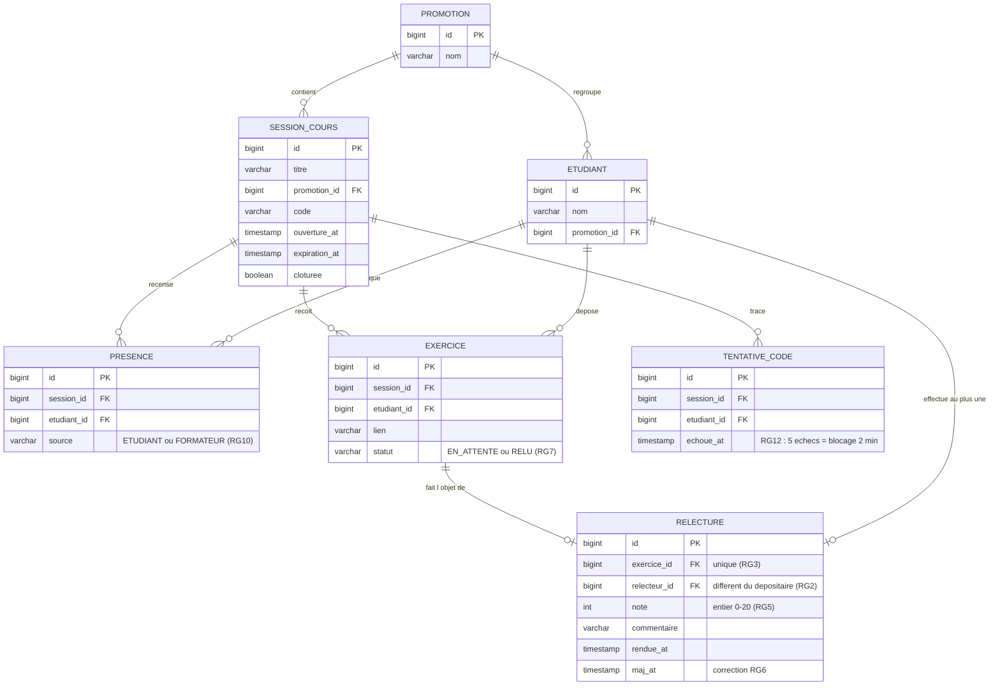

# D2 — Modèle de données (cohérent avec `backend/src/main/resources/db/migration/V1__init.sql`)

Contraintes uniques portées par les migrations : `PRESENCE (session_id, etudiant_id)` (RG13) · `EXERCICE (session_id, etudiant_id)` (409 EXERCICE_DEJA_DEPOSE) · `RELECTURE.exercice_id` unique (RG3) · `SESSION_COURS.code` unique.
