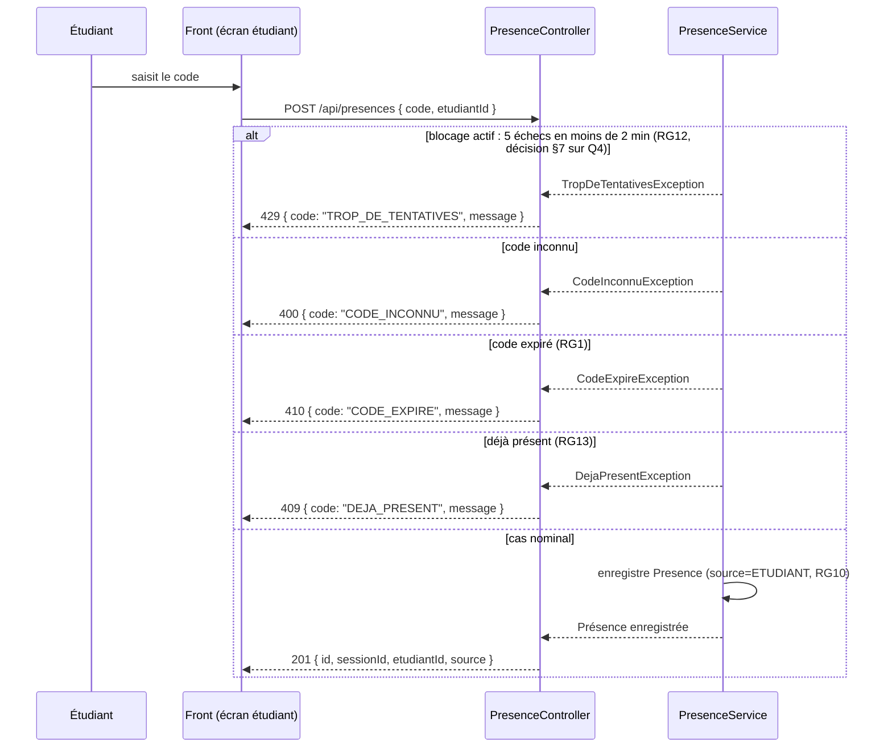

# D3 — Séquence : marquer sa présence (cas nominal + 2 cas d'erreur, codes HTTP du contrat)

```mermaid
sequenceDiagram
    participant E as Étudiant
    participant F as Front (écran étudiant)
    participant API as PresenceController
    participant S as PresenceService

    E->>F: saisit le code
    F->>API: POST /api/presences { code, etudiantId }

    alt blocage actif : 5 échecs en moins de 2 min (RG12, décision §7 sur Q4)
        S-->>API: TropDeTentativesException
        API-->>F: 429 { code: "TROP_DE_TENTATIVES", message }
    else code inconnu
        S-->>API: CodeInconnuException
        API-->>F: 400 { code: "CODE_INCONNU", message }
    else code expiré (RG1)
        S-->>API: CodeExpireException
        API-->>F: 410 { code: "CODE_EXPIRE", message }
    else déjà présent (RG13)
        S-->>API: DejaPresentException
        API-->>F: 409 { code: "DEJA_PRESENT", message }
    else cas nominal
        S->>S: enregistre Presence (source=ETUDIANT, RG10)
        S-->>API: Présence enregistrée
        API-->>F: 201 { id, sessionId, etudiantId, source }
    end
```
