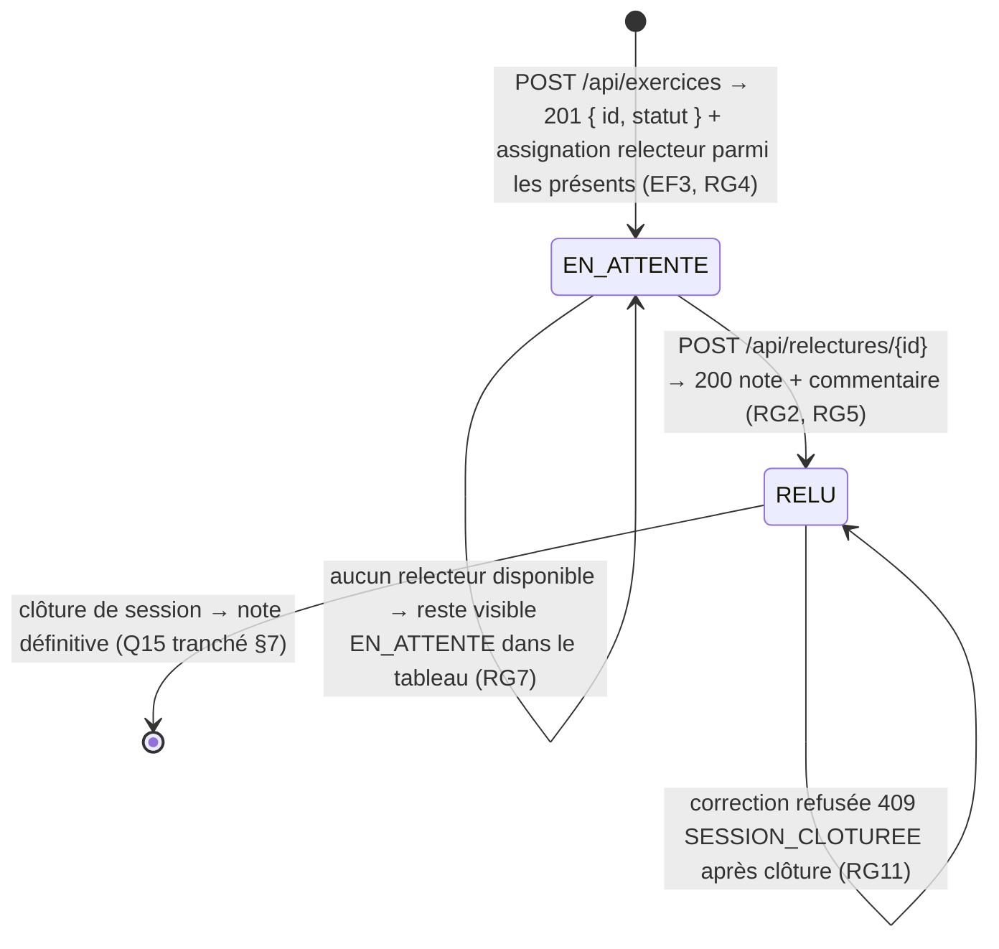

# D4 — États-transitions du cycle de vie d'un exercice (bonus)

```mermaid
stateDiagram-v2
    [*] --> EN_ATTENTE: POST /api/exercices → 201 { id, statut } + assignation relecteur parmi les présents (EF3, RG4)
    EN_ATTENTE --> EN_ATTENTE: PUT /api/exercices/{id} → 200 (RG9 : lien remplacé, personne n'a relu)
    EN_ATTENTE --> EN_ATTENTE: PUT /api/relectures/{id} refusé 409 si déjà rendue
    EN_ATTENTE --> RELU: POST /api/relectures/{id} → 200 note + commentaire (RG2, RG5)
    EN_ATTENTE --> EN_ATTENTE: aucun relecteur disponible → reste visible EN_ATTENTE dans le tableau (RG7)
    RELU --> RELU: PUT /api/relectures/{id} → 200 correction de note (RG6, session non clôturée)
    RELU --> RELU: correction refusée 409 SESSION_CLOTUREE après clôture (RG11)
    RELU --> [*]: clôture de session → note définitive (Q15 tranché §7)
```
